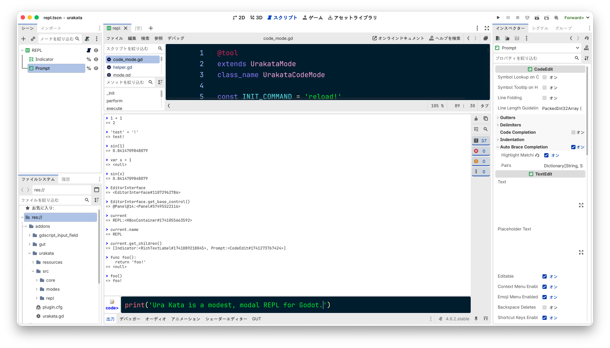
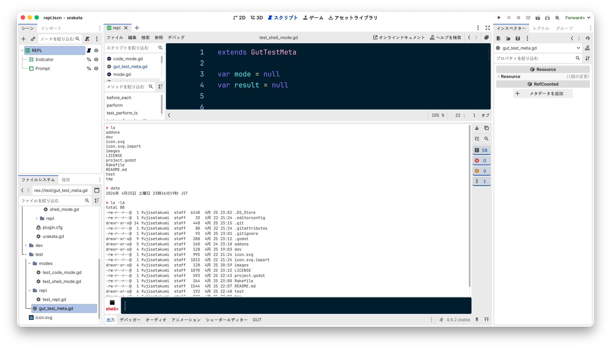
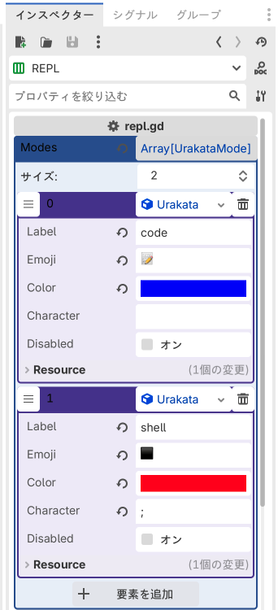

# 👥🥷👥 Ura Kata

A modest, modal REPL for Godot.

Demo Video: https://www.youtube.com/watch?v=7tLOr-d4Qek


## Screenshots

### Code mode


### Shell mode



## Usage

Ura Kata provides multiple interactive modes.
When the input line is empty, typing a specific single character switches the current mode.

* **Default:** Code mode
* **`;`** switches to Shell mode


### Code mode (default)

```
code> 1 + 1
=>  2

code> var x = 1
=> null

code> x
=> 1

code> sin(x)
=> 0.8414709848079

code> func foo(): return 'foo!'
=> null

code> foo()
=> 'foo!'

code> EditorInterface
=> <EditorInterface#11072962786>

code> EditorInterface.get_editor_scale()
=> 2.0
```

To reset the execution environment, type `reload!`.
```
code> x
=> 1

code> reload!
Reloaded.

code> x
ERROR: Invalid named index 'x' for base type Object
ERROR: gdscript://-9223352824325131985.gd:2 - Parse Error: Identifier "x" not declared in the current scope.
=> <null>
```

You also have access to several utility variables and helper methods.
```
code> current
=> REPL:<HBoxContainer#1741055663592> # Returns the root node of the currently edited scene.
```


### Shell mode (`;`)
```
shell> ls
addons
dev
icon.svg
icon.svg.import
images
LICENSE
project.godot
Rakefile
README.md
test
tmp

shell> ls -lA addons/urakata
total 24
-rw-r--r--@ 1 fujisetakumi  staff  127  4月 25 21:04 plugin.cfg
drwxr-xr-x@ 4 fujisetakumi  staff  128  4月 25 22:12 resources
drwxr-xr-x@ 5 fujisetakumi  staff  160  4月 24 21:24 src
-rw-r--r--@ 1 fujisetakumi  staff  427  4月 23 21:52 urakata.gd
-rw-r--r--@ 1 fujisetakumi  staff   19  4月 22 21:25 urakata.gd.uid
```


## Installation

1. Download the addons.tar.gz from the release.
2. Extract the addons.tar.gz and place the redscribe directory into (Your godot project root)/addons directory.
3. Open the project settings and enable Urakata.


## Customization

### Adding a Custom mode

Ura Kata allows you to extend the REPL by adding your own modes.

A mode is simply a script that inherits `UrakataMode` and implements `perform(text: String)`.

#### 1. Define a mode Script
```gdscript
@tool
extends UrakataMode
class_name UrakataXxxMode

func perform(text: String) -> Variant:
  var result = null
  # do_something
	return result
```

#### 2. Register the mode in the REPL
Open the scene `addons/urakata/src/repl/repl.tscn`.

In the Inspector, find the *Modes* array.



Add a new element and set the following fields:
* **Label**: Display name of the mode
* **Emoji**: Icon shown in the REPL prompt
* **Color**: Accent color for the mode
* **Character**: Prefix character to activate the mode (e.g. `?`, `/`)


## Roadmap

### v0.1.0
* [x] Simple Code mode
* [x] Simple Shell mode

### v0.2.0 or later
* [ ] Add other useful modes
* [ ] Bug fix
  * [ ] Code mode
    * [ ] Value reassignment fails. (e.g. `var x = 1` then `x = 2` fails)
    * [ ] Method chain is not working (e.g. `[1, 2].map(func(c): return i)`.

